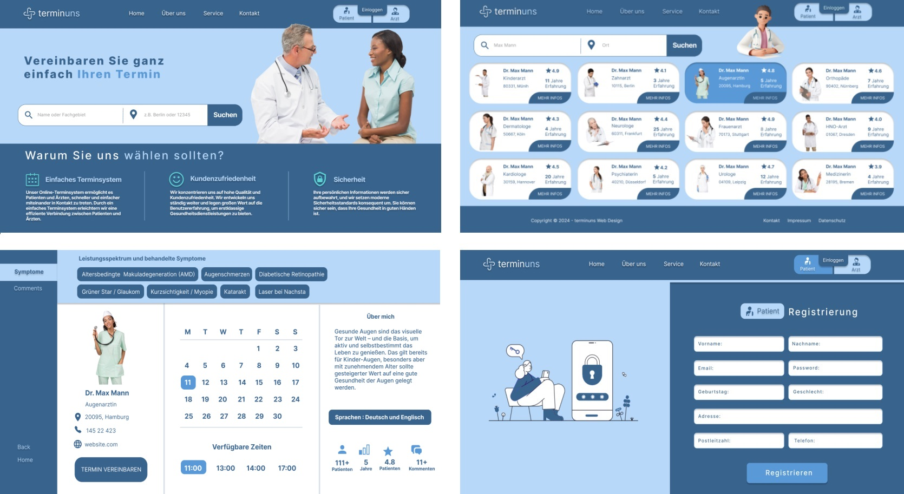
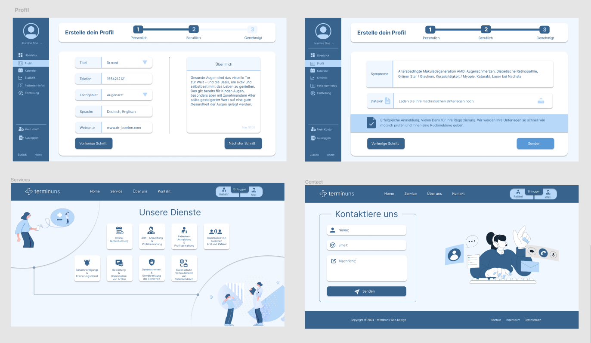

# Patient - Doctor Appointment App

This project includes a full-stack web application that allows patients and doctors to schedule and manage appointments.

## Technologies used - tools
 
**Frontend:**
- React
- Redux Toolkit
- Hooks (such as useCallback, useRef, useEffect, useState)
- Axios
- Toastify
- TailwindCSS
- Material-UI (Mui)
- Formik-Yup
- React-Google-Charts
- React-DOM
- React-Calendar
- Tremor
- React-Scripts
- Redux-Persist
- Fullcalendar
- React-Hook-Form

**Backend:**
- Node.js
- JavaScript
- MongoDB
- Mongoose
- Express.js
- dotenv
- cors
- cookie-session
- express-async-errors
- morgan
- multer
- nodemailer
- redoc-express
- swagger-autogen

## Project Details:

**Simple Appointment System**
Our online appointment system allows patients and doctors to connect more quickly and easily. With a simple appointment system, we facilitate efficient communication between patients and doctors.

**Customer Satisfaction**
We focus on high quality and customer satisfaction. We are constantly evolving and place great emphasis on user experience to provide top-notch healthcare services.

**Security**
Your personal information is securely stored, and we consistently implement modern security standards. You can rest assured that your health is in good hands.

**Online Appointment Booking**
Our online appointment scheduling tool provides a user-friendly interface for quick and easy appointment planning for both patients and doctors.

**Doctor Registration & Profile Management**
Doctors have the option to create and update their profiles, specifying their areas of expertise and working hours.

**Patient Registration & Profile Management**
We offer services for creating and updating patient records, securely storing health history and personal information in the patient profile.

**Communication between Doctor and Patient**
Our platform enables effective communication between doctor and patient through various options such as messaging. Questions can be clarified both before and after the appointment.

**Notification & Reminder Service**
With our service, you will receive reminder messages on the day of the appointment, as well as instant notifications and emails about appointment changes or cancellations.

**Adding Notes and Tasks**
Patients and doctors can add daily tasks and general notes.

**Data Security & Privacy**
The security and confidentiality of your patient data are our top priority. We apply encryption and protection protocols for all data transmissions.

We are proud to offer you an innovative and secure platform for healthcare. If you have any questions, we are available at any time.

**There are 3 different dashboards** 
Patient dashboards - Doctor dashboards - Admin dashboards

---

**Frontend:**
- Created using React.
- Utilizes libraries such as React Router, Tailwind, Formik, Yup, and Toastify.

**Backend:**
- Developed with Node.js and Express.js.
- Utilizes MongoDB as the database, integrated with Mongoose.

**Authentication and Authorization:**
- User authentication is managed using Token Authentication.
- Authorization is implemented using React Router's security features.

**Project Structure:**

- **client:** Frontend code
  - **src:**
    - **components:** React components
    - **pages:** Application pages
    - **utils:** Helper functions and constants

- **server:** Backend code
  - **controllers:** MongoDB operations and business logic
  - **models:** MongoDB schemas
  - **routes:** API routes
